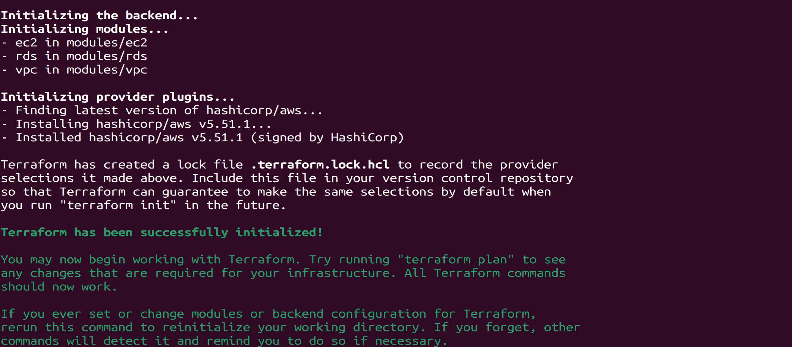
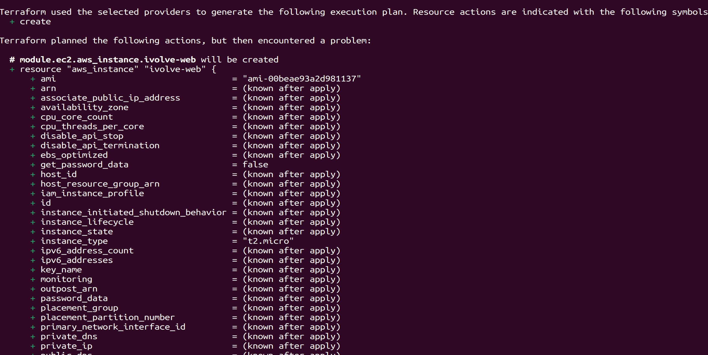
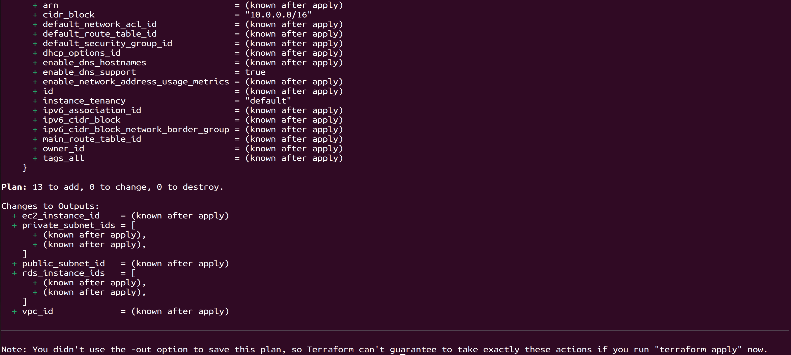

# Terraform Multi-Tier Application Deployment

This Terraform project automates the deployment of a multi-tier architecture on AWS. The architecture includes a Virtual Private Cloud (VPC), public and private subnets, EC2 instances, and RDS databases.

## Project Structure

The project structure is organized into modules for better management and reusability:

- `modules/vpc`: Defines the VPC, subnets, and associated resources.
- `modules/ec2`: Deploys the EC2 instance in the public subnet.
- `modules/rds`: Creates RDS instances in the private subnets.

## Prerequisites

Before running Terraform, make sure you have:

1. AWS CLI configured with appropriate credentials.
2. Terraform installed on your machine.

## Usage


1. Initialize Terraform:

   ```bash
   terraform init
   ```
   

2. Review and adjust variables in `variables.tf` according to your requirements.
   

   
3. Apply the Terraform configuration:

   ```bash
   terraform apply --auto-approve
   ```
   

      

   

## Configuration Files

### `variables.tf`

- Defines input variables for the project, including VPC CIDR, subnet CIDRs, AZs, AMI IDs, instance types, database credentials, etc.
- Specifies values for the variables by default

### `main.tf`

- Orchestrates the deployment by calling modules for VPC, EC2, and RDS resources.

### `outputs.tf`

- Defines outputs to display after Terraform applies the configuration, such as VPC ID, subnet IDs, EC2 instance ID, and RDS instance IDs.

## Customization

Feel free to customize the configuration files as per your project requirements. You can modify subnet CIDRs, AZs, instance types, database credentials, etc., in the variables and configuration files.

## Screenshots

   

   

   

   
## Cleanup

After testing or when done with the resources, you can destroy them using Terraform:

```bash
terraform destroy --auto-approve
```

## Notes

- Make sure to review and understand the changes before applying Terraform to avoid unintended consequences.
- Always follow best practices for security and cost optimization when deploying resources on AWS.

