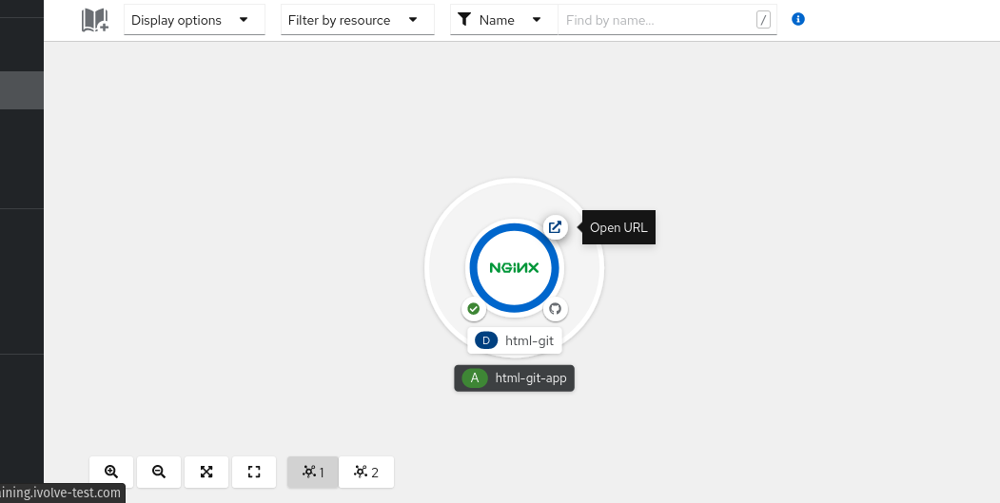

# Lab 16: Source-to-Image (S2I) Workflow
Source-to-Image (S21) Workflow Objective: Use Source-to-Image to build container images directly from application source code. Deploy an application using the S21 workflow. Clone the HTML application repository from GitHub: https://github.com/IbrahimmAdel/html.git Create a BuildConfig in OpenShift to build the HTML application using the Nginx builder image. Name the BuildConfig my-html-app. Start the build process for the BuildConfig my-html-app. View the build logs and monitor the progress. Once the build is complete, expose the service and access the website.

### There is two ways to create buildconfig in openshift

1. **From oc cli**

2. **From openshift console**


## 1. From oc cli

### First login in your cluster

### Create new App As:

  ```
  oc new-app --image=registry.access.redhat.com/rhscl/nginx-114-rhel7:latest --code=https://github.com/IbrahimmAdel/html.git --name=my-app -n alikhames

  ```
### Start new build 

  ```
  oc start-build my-app -n alikhames

  ```
### view logs

  ```
  oc logs -f bc/my-app -n ahlamahmed
  ```
  
### Expose app service

  ```
  oc expose svc my-app

  oc get route

  ```


## 2. From openshift console 
 
 
 
 
  
 
 
 

  ### And you can delete it by right click on the application
 